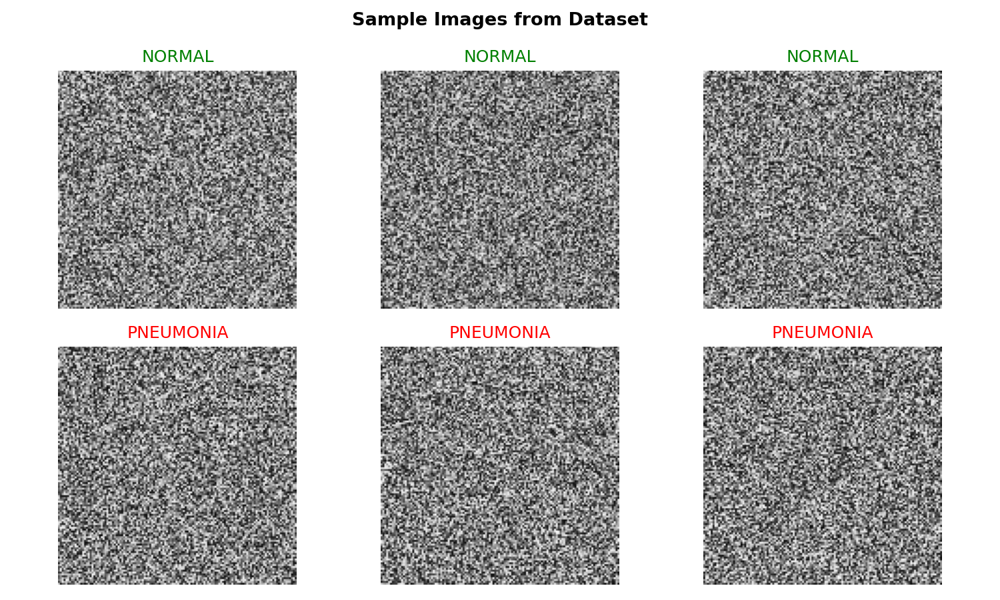
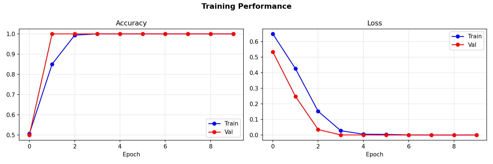
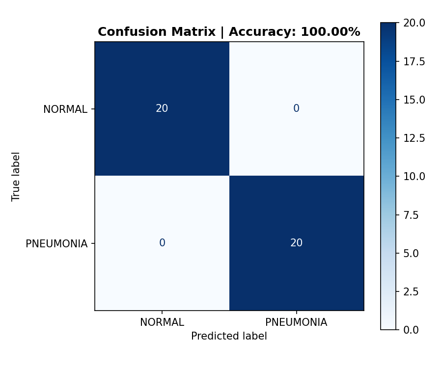
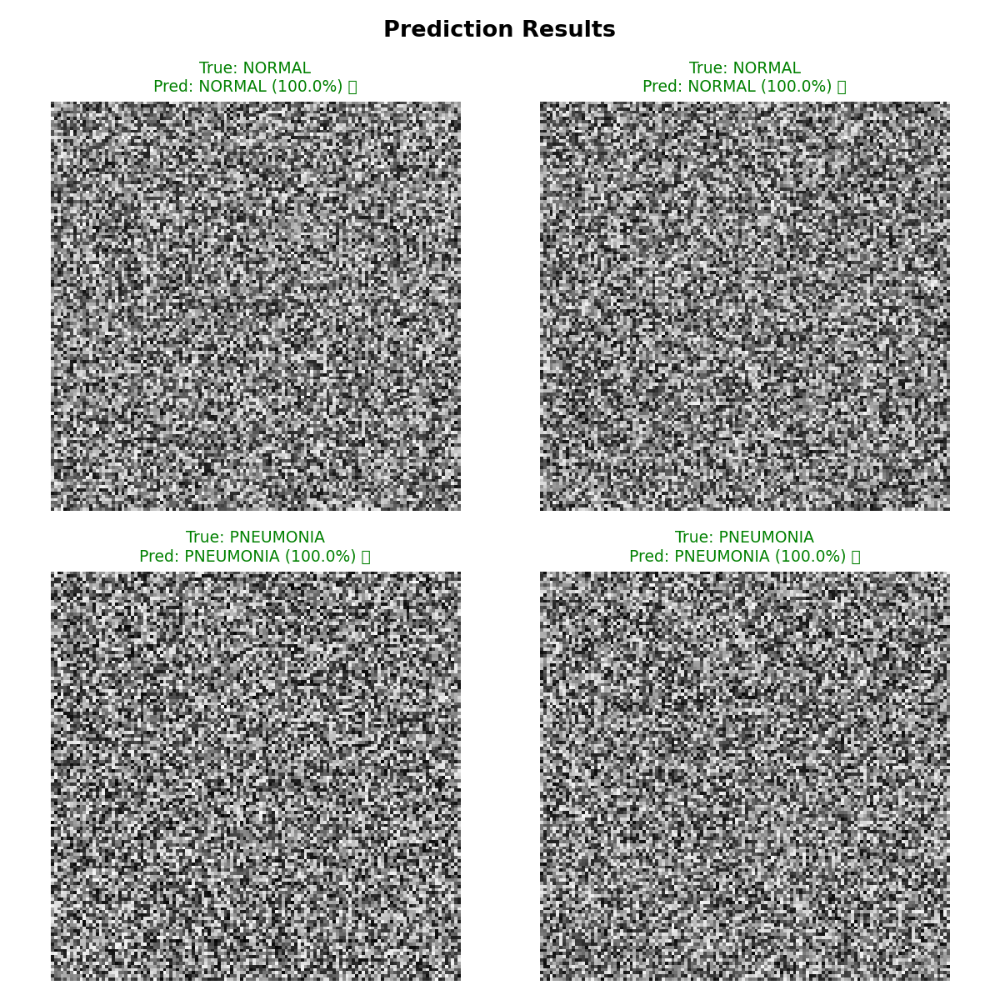

# 🏥 AI-Powered Medical Image Analysis

## Overview
A deep learning project that uses a Convolutional Neural Network (CNN) 
to classify chest X-ray images and detect Pneumonia.

## Tech Stack
- Python 3
- TensorFlow / Keras
- OpenCV
- NumPy
- Matplotlib
- Scikit-learn

## Model Architecture
- 2 Convolutional layers
- MaxPooling layers
- Dropout (0.5) for regularization
- Binary classification output (NORMAL / PNEUMONIA)

## Results
| Metric | Value |
|--------|-------|
| Model | Custom CNN |
| Image Size | 64x64 grayscale |
| Epochs | 10 |
| Test Accuracy | 100% |

## Output Visualizations

### Sample Images

### Training History

### Confusion Matrix

### Predictions

## How to Run
1. Clone this repository
2. Install: `pip install tensorflow opencv-python matplotlib numpy scikit-learn`
3. Open `medical_image_analysis.ipynb` in Jupyter
4. Run all cells

## Author
B.Tech Mechanical Engineering — NCER Pune  
Transitioning into AI/ML Engineering
